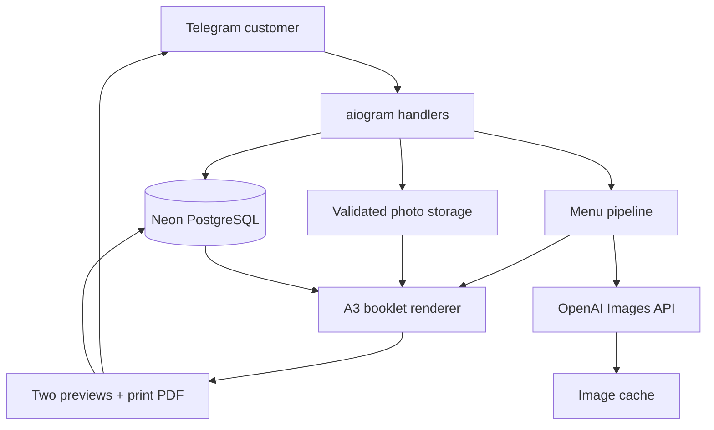
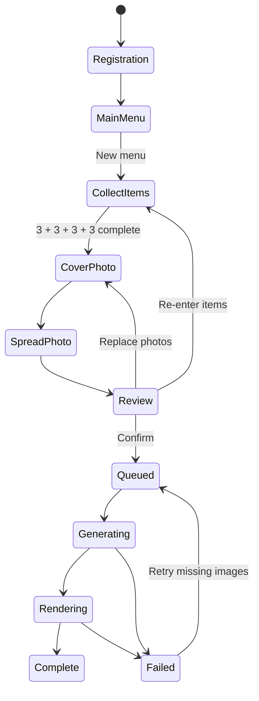

# Food_Porn architecture

## State sequence

The worker processes image requests sequentially. A cache hit performs no API call. A quota-exhausted response opens a five-minute local circuit breaker and stops the current menu immediately; rendering starts only after every non-skipped item has a valid image file.

## Deployment boundary

The MVP is intentionally one process: Telegram polling and one durable-state pipeline. Database state makes restarts recoverable. When volume requires multiple replicas, split the worker into its own deployment, move media to object storage, and use a broker-backed queue with idempotency keyed by `menu_id`.
